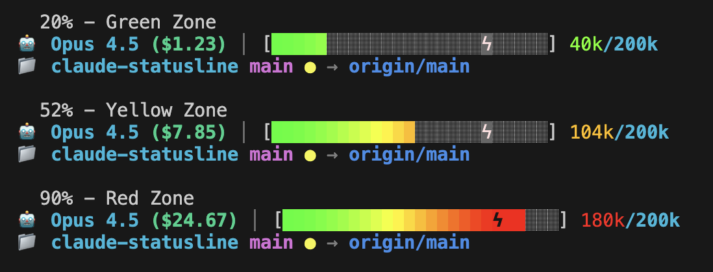
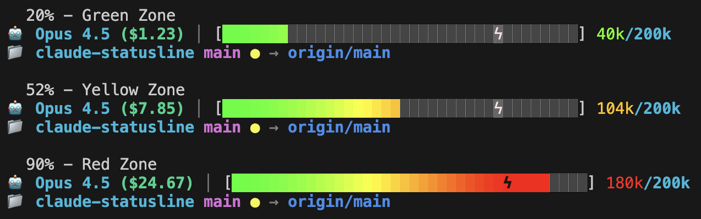

# @buckits/claude-statusline

<div align="center">

**The statusline Claude Code deserves.**

[](https://www.npmjs.com/package/@buckits/claude-statusline)
[](https://opensource.org/licenses/MIT)

<br>


<br>

[Features](#features) • [Installation](#installation) • [Screenshots](#what-it-looks-like) • [GSD Compatible](#-gsd-compatible)

</div>

---

## Why This Statusline?

Claude Code's default statusline is... minimal. You deserve better.

**This statusline shows you everything you need at a glance:**

- 🎨 **Gradient progress bar** that flows green → yellow → red as you approach the limit
- ⚡ **Auto-compact threshold marker** so you know exactly when Claude will summarize
- 💰 **Session cost tracking** in real-time
- 🔀 **Full git integration** with branch, status, and ahead/behind tracking

## Features

### 🎨 Gradient Progress Bar

Smoothly transitions through colors as your context fills up. Choose your width during install—Compact (25), Medium (38), Full (50), or Custom (any number 10-100). The gradient is calculated relative to the auto-compact threshold, not total capacity—so you always know how close you are to summarization.

### ⚡ Auto-Compact Threshold

A red lightning bolt marks exactly where Claude will auto-summarize (78%). No more surprises—you'll see it coming.

### 💰 Real-Time Cost

See your session cost update as you work: `($12.41)`

### 🔀 Git Status at a Glance

| Symbol | Meaning |
|--------|---------|
| `✓` | Clean - all committed |
| `●` | Unstaged changes |
| `✚` | Staged and ready |
| `●✚` | Both staged and unstaged |
| `↑5` | 5 commits ahead of remote |
| `↓2` | 2 commits behind remote |

### 📊 2-Line Dashboard

- **Line 1:** 🤖 Model • Cost • Context Progress
- **Line 2:** 📁 Project • Branch • Git Status • Remote Tracking

## Installation

```bash
npx @buckits/claude-statusline
```

That's it. The installer will:
1. Ask where to install (global or local)
2. Let you choose your progress bar width
3. Copy the statusline script
4. Configure your settings

### Options

```bash
# Interactive (recommended)
npx @buckits/claude-statusline

# Install globally for all projects
npx @buckits/claude-statusline --global

# Install for current project only
npx @buckits/claude-statusline --local

# Uninstall (global)
npx @buckits/claude-statusline --global --uninstall

# Uninstall (local)
npx @buckits/claude-statusline --local --uninstall
```

## What It Looks Like

### Compact (25 bars)



### Medium (38 bars)



### Full (50 bars)


## 🤝 GSD Compatible

This statusline works perfectly alongside [Get Shit Done (GSD)](https://www.npmjs.com/package/get-shit-done-cc)!

If you have GSD installed, the statusline will automatically show update notifications when a new GSD version is available.

```bash
# Install both for the ultimate Claude Code setup
npx @buckits/claude-statusline
npx get-shit-done-cc
```

## Requirements

- **Claude Code CLI** (obviously)
- **Node.js** >= 14
- **Git** - for git status features (optional)

## Manual Installation

If you prefer to install manually:

1. Copy `statusline.cjs` to `~/.claude/statusline.cjs`
2. Add to `~/.claude/settings.json`:

```json
{
  "statusLine": {
    "type": "command",
    "command": "/Users/YOUR_USERNAME/.claude/statusline.cjs --width 50"
  }
}
```

## Troubleshooting

### Statusline not showing?

1. Make sure you restarted Claude Code after installation
2. Verify the script exists: `ls -la ~/.claude/statusline.cjs`

### Wrong colors?

Your terminal needs to support true color (24-bit). Most modern terminals do.

### Git status not showing?

Make sure you're in a git repository with at least one commit.

## Contributing

Issues and PRs welcome at [github.com/Buckits/claude-statusline](https://github.com/Buckits/claude-statusline)

## License

MIT © [Buckits](https://github.com/Buckits)

---

<div align="center">

**Made for the Claude Code community** 🤖

*Star this repo if you find it useful!*

</div>
